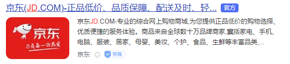

# 准备
## 目录创建
京东项目
    --css
    --js
    --images
    --fonts
    --index.html
    --favico.ico
## 准备css
```
normalize.css //这是一个非常常用的浏览器兼容性css文件，github star好几万。
base.css //写一些我们的公共样式
 ```
## 制作ico图标
获取浏览器的ico图片的通用方式
jd.com/favico.ico
```
//在线生成完整
www.bitbug.net
```
## 引入css样式

    <link rel="icon" href="favicon.ico" >
    <link rel="stylesheet" href="css/normalize.css">
    <link rel="stylesheet" href="css/base.css">
## 三大标签优化
这是seo优化，给搜索引擎看的，能帮助吸引用户，这个非常重要。
不可以随便写的，是有讲究的。

**title**：百度要求不能超过28个中文，google要求不能超过35个中文。
按百度的要求就行。

`京东(JD.COM)-正品低价、品质保障、配送及时、轻松购物！`

**description**：优化使用搜索引擎看到的小页面
不要超过120个汉字。

**keywords:**
限制在6-8个，电商多少许。
```
<meta name="Keywords" content="网上购物,网上商城,家电,手机,电脑,服装,居家,母婴,美妆,个护,食品,生鲜,京东">
```
## 字体库
https://icomoon.io/